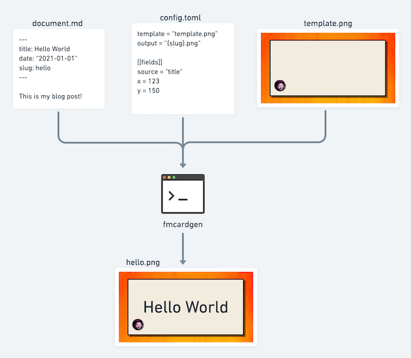
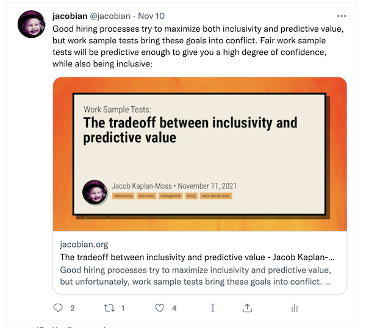

# fmcardgen

`fmcardgen` generates images from documents with frontmatter:



It's mostly designed for generating those social media cards you see on Twitter. I wrote it so that my tweets would look like this:



I'll bet you can use it for other things, but 🤷🏻‍♂️.

## Warning: this isn't well-supported software!

I wrote this mostly for me, but am sharing it because why not. I'm unlikely to respond to bug reports, and very unlikely to respond to feature requests unless they're something I want to. I may merge pull requests if they include tests which pass.

## Quick HOWTO:

You'll need three things:

1. Some documents, or one at least, written in plain text with [Jekyll-style frontmatter](https://jekyllrb.com/docs/front-matter/). Frontmatter can be encoded in YAML (use `---` to delimit the block), TOML (marked by `+++`), or JSON (`{` and `}`).
2. A template file. This is the blank background that text from your frontmatter will be overlayed upon. It can be any size you like. Mine is in the `tests/` directory if you want inspiration, but please don't rip off my template!

3. A config file (which can also be YAML, TOML, or JSON). A minimal config file looks like this (in TOML):

   ```toml
   template = "template.png"
   output = "{slug}.png"

   [[fields]]
   source = "title"
   x = 100
   y = 100
   ```

   The [full list of config options is documented below](#configuration-options).

Given all the above, then you run:

```bash
fmcardgen --config config.toml path/to/post.md
```

Or, to generate a whole bunch of cards from a directory full of documents:

```bash
fmcardgen --config config.toml --recursive my/content/dir/
```

See `fmcardgen --help` for the full range of options.

## Configuration Options

Working on it...
